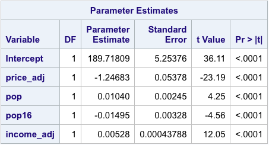
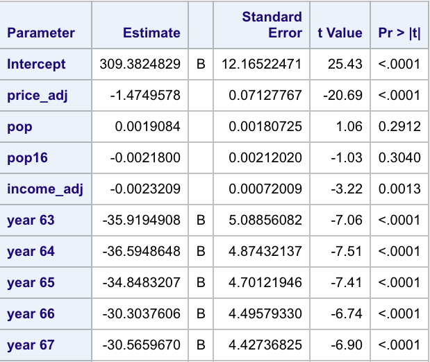
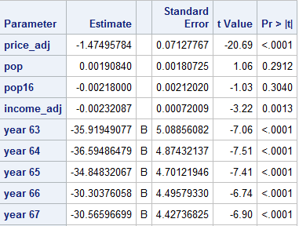
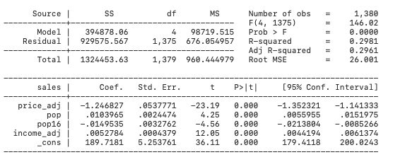
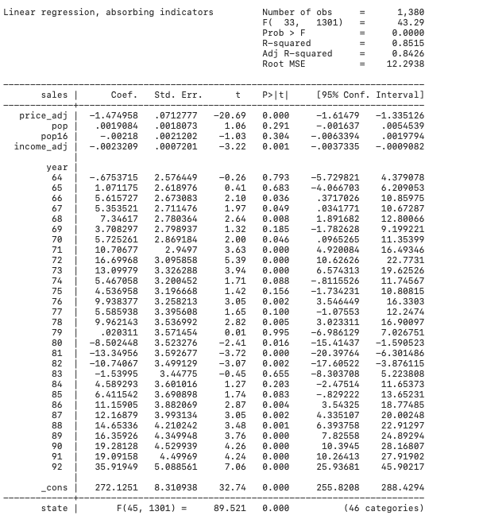
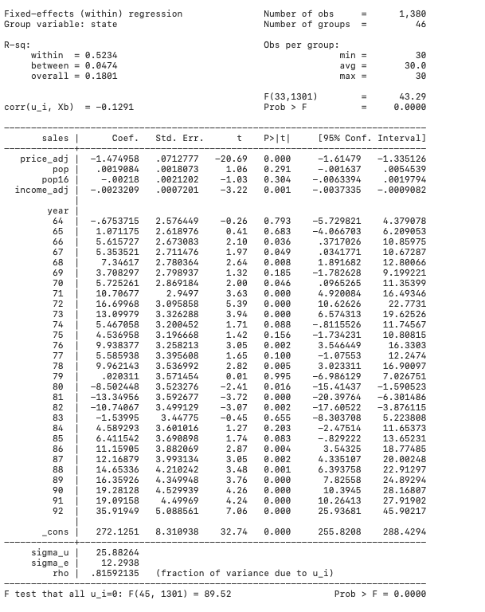
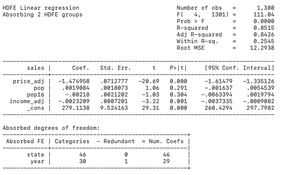

```{r setup, include=FALSE}
knitr::opts_chunk$set(echo = TRUE)
```


### Introduction to Fixed effects model


#### General Description

In statistics, a **fixed effects model** is a statistical model in which the model parameters are fixed or non-random quantities.

Generally, data can be grouped according to several observed factors. The group means could be modeled as fixed or random effects for each grouping. In a fixed effects model each group mean is a group-specific fixed quantity.

The fixed effect assumption is that the individual-specific effects are correlated with the independent variables. 

The fixed effect models assist in controlling for unobserved heterogeneity when this heterogeneity is constant over time. This heterogeneity can be removed from the data through differencing, for example by taking a first difference which will remove any time invariant components of the model.


#### Panel Data

In this tutorial, we will focus on fixed effects model with panel data. 

Panel data (also known as longitudinal or cross-sectional time-series data) is a dataset in which the behavior of entities
are observed across time.The entities could be states, companies, individuals, countries, etc.

In panel data, fixed effects represent the subject-specific means. In panel data analysis the term fixed effects estimator is used to refer to an estimator for the coefficients in the regression model including those fixed effects (one time-invariant intercept for each subject).


#### Classical Representation

The linear unobserved effects model for $N$ observations and $T$ time periods:

$$y_{it}=X_{it}\beta+\alpha_i+\mu_{it} ,\ for \ t=1,..,T \ and \  i=1,...,N$$

Where:

$y_{it}$ is the dependent variable observed for individual i at time t.

$X_{it}$ is the time-variant $T\times k$ (the number of independent variables) regressor matrix.

$\beta$ is the $k\times 1$ matrix of parameters.

$\alpha _{i}$ is the unobserved time-invariant individual effect. 

$\mu_{it}$ is the error term.


### Example Dataset: Cigar

The dataset **Cigar** is a panel of 46 observations from 1963 to 1992 of cigarette consuming.

The total number of observations is 1380.

The panel data **Cigar** looks like this （first 10 observations）:

```{r data_table1,echo=FALSE,message=FALSE}

library(tidyr)
library(plm)
data(Cigar)

Cigar[1:10,] %>%
  knitr::kable( align = 'r')

```


####Variables: 

The varaibles used for regression and fixed effect model:

  Dependent variable: 
        
    sales: cigarette sales in packs per capita.

  Independent variables (may be transformed): 
      
    pop: population.
                        
    pop16: population above the age of 16.
    
    price: price per pack of cigarettes.
    
    cpi: consumer price index (1983=100).
    
    ndi: per capita disposable income.
    
  Fixed effects variables:
    
    state (46 levels): state abbreviation.
    
    year (29 levels): the year.


### Tutorial in R 


#### Data Manipulation

Import the data:

```{r R_code_1}
# data: the dataset 'Cigar' is the 'plm' package
library(plm)
data(Cigar)
```

Transform the variables:

```{r R_code_2,message=FALSE}
# Adjust the price, and disposable income with cpi to 
# get the dollar value in 1983
attach(Cigar)
Cigar$price_adj=(price/cpi)*100
Cigar$income_adj = (ndi/cpi)*100
```


#### OLS regression

```{r R_code_3}
# Run ordinary linear regression without fixed effect
ols = lm(sales ~ price_adj + pop + pop16 + income_adj, data = Cigar)
summary(ols)
```

#### Fixed Effects Models

There are three ways to do with R, using the regular funtions **lm**, the **felm** in the **lfe** package, or **plm** in the **plm** package. In fact, they produce the same results. 

The **lm** generates dummies variables for *state* and *year* and then run linear regression. However, the **felm** and **plm** will absorb individual fixed effects estimates. 

If we just want to control for fix effect and only care about coefficients of interests, either **felm** and **plm** is a good choice. But if we want to know the effect of some specific groups, **lm** is preferred. 

##### Basic R:

In fact, the summary of **lm** will show individual fixed effects estimates for every year and every state. But for convenience, we only show the estimated coefficients of independent variables and first five estimated effects for years.

```{r R_code_4}
# Fixed effects using Least squares dummy variable model
ols_fixed = lm(sales ~ price_adj + pop + pop16 + income_adj +factor(year) + factor(state), data = Cigar)
summary(ols_fixed)$coefficients[1:10,]
```


##### Package **lfe**:

```{r R_code_5,warning=FALSE,message=FALSE}
# Using lfe package for *state* and *year* and fit a model 
library(lfe)
felm_fixed = felm(sales ~ price_adj + pop + pop16 + income_adj |factor(year) + factor(state), data = Cigar)
summary(felm_fixed)
```

##### Package **plm**:


```{r R_code_6, warning=FALSE,message=FALSE}
# Use plm package tfor *state* and *year* and fit a model
library(plm)
plm_md = plm(sales ~ price_adj + pop + pop16 + income_adj, data = Cigar,
          index = c("year", "state"), model = "within", effect = "twoways")
summary(plm_md)
```


### Tutorial in SAS


#### Data Manipulation

Import the data:

```{r sas_1,eval=FALSE}
proc import datafile=".\Cigar.csv" 
out=mydata dbms=csv replace; 
getnames=yes; 
run;
```

Transform the variables:

```{r sas_2, eval=FALSE}

# /*change the price, and income with cpi to get the dollar value in 1983 */
data Cigar; set mydata;
price_adj = (price/cpi)*100;
income_adj = (ndi/cpi)*100;
run;
```


#### OLS regression

```{r sas_3, eval=FALSE}
proc reg data=Cigar; 
 model sales = price_adj pop pop16 income_adj;
 run;
quit;
```


#### Fixed Effects Models

In SAS, the **glm** is to fit with fixed effects models. In **glm**, we can either use **class** or **absorb** to determine the fixed effects variables. 

If we want to see the fixed effects estimates for every *state* and every *year*, **class** will be the first choice. The **class** will automatically generate a set of dummy variables for each level of the variable *state* and *year*.

It we only want to know the estimates of our interested independent variables, we can use **absorb** instead of **class**. But it can only absorb one variable at a time. And to use the **absorb**, we need to supress the intercept to avoid a dummy variable trap.

We only show the estimated coefficients of independent variables and first five estimated effects for years.

##### Use **class**:

For convenience, we only show the estimated coefficients of independent variables and first five estimated effects for years. But in fact, in SAS, individual fixed effects estimates for every *state* and every *year* will be displayed. 

```{r sas_4, eval=FALSE}
proc glm data=Cigar;
 class year state; 
 model sales = price_adj pop pop16 income_adj year state/ solution; run;
quit;
```


##### Use **absorb**:

In SAS, as we absorb the variable *state*, only individual fixed effects estimates for every *year* will be displayed. And we only show the first five estimated effects for years.

```{r sas_5, eval=FALSE}
proc glm data=Cigar;
 absorb state; 
 class year;
 model sales = price_adj pop pop16 income_adj year/ solution noint; run;
quit;
```



### Tutorial in STATA


#### Data Manipulation

Import the data:

```{r stata_1,eval=FALSE}
import delimited Cigar.csv, clear
```

Transform the variables:

```{r stata_2, eval=FALSE}
## change the price, and income with cpi to get the dollar value in 1983
g price_adj = (price/cpi)*100
g income_adj = (ndi/cpi)*100
```


#### OLS regression

```{r stata_3, eval=FALSE}
reg sales price_adj pop pop16 income_adj
```


#### Fixed Effects Models

There are three ways to do with STATA, using the commands **areg**, **xtreg**, or **reghdfe**. In fact, they produce the same results.

The **areg** and **xtreg** cannot absorb more than one fix effect, but we can still put factor variable i.var in. Sometimes, they are computationally inefficient since they actually calculate and report coefficients for those dummy variables. However, in some cases they could be helpful if we want to see the effect of one specific group. 

If we just want to control for fix effect and only care about another coefficients of interests, **reghdfe** is the best option.

#####  Command **areg**:
```{r stata_4,eval=FALSE}
areg sales price_adj pop pop16 income_adj i.year, absorb(state) 
```



##### Command **xtreg**:
```{r stata_5,eval=FALSE}
xtset state year
xtreg sales price_adj pop pop16 income_adj i.year, fe 
```


##### Command **reghdfe**:

install packages:

```{r stata_6, eval=FALSE}
ssc install reghdfe
ssc install ftools
```

regression: 

```{r stata_7, eval=FALSE}
reghdfe sales price_adj pop pop16 income_adj, absorb(state year)
```



### Summary and Discussion


#### Compare Fixed Effects Model to OLS 

With fixed effect, the negative effect of *price* on *sales* is stronger in magnitude than the OLS, and the coefficient on *income* flips sign. It highlights the importance of controlling for fix effect.

#### Absorption or Not

When computing fixed effects models estimates, we should choose to absorb them or not. It depends on what our aim is. Absorption is computationally fast, and looks concisely, however, individual fixed effects estimates will not be showed. So to get individual fixed effects estimates, the preferred method is the way that will automatically generate a set of dummy variables for each level of the fixed effects variable.

### References

**Wikipedia:** [Fixed effects model](https://en.wikipedia.org/wiki/Fixed_effects_model/)

**R Package:** [plm](https://cran.r-project.org/web/packages/plm/)

**STATA Package: ** [reghdfe](http://scorreia.com/demo/reghdfe.html)

**Notes: ** [Panel Data using R](https://www.princeton.edu/~otorres/Panel101R.pdf)
            
**Notes: ** [Fixed Effects in SAS](https://kelley.iu.edu/nstoffma/fe.html)
